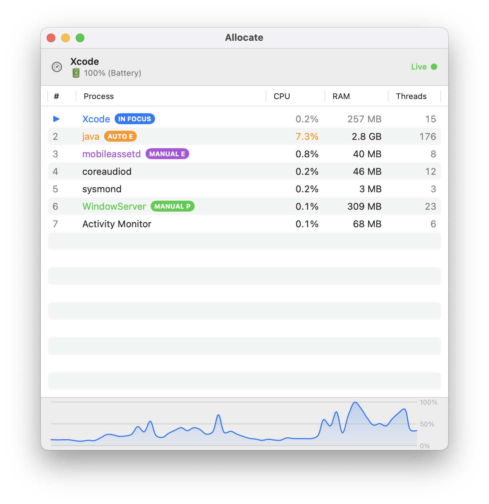
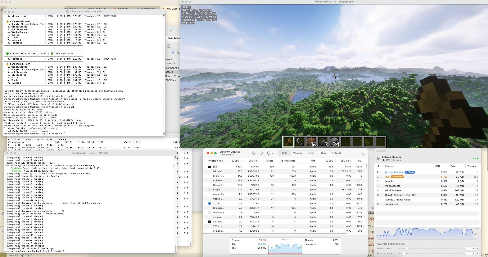
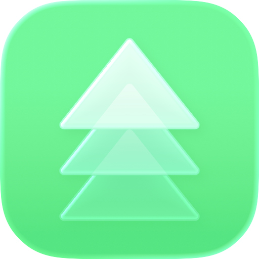

# Allocate

## Gallery

- Top-left: Rust daemon terminal UI
- Top-right: Minecraft, running with shaders + Distant Horizons (256 chunk render distance)
- Bottom-left: `dummy-hog` computing infinitely large prime numbers
- Bottom-middle: macOS Activity Monitor
- Bottom-right: Pre-release Allocate UI with process table, live CPU chart, and configurable thresholds 

<table align="center" border="0">
  <tr>
    <td></td>
    <td></td>
    <td></td>
  </tr>
  <tr>
    <td></td>
    <td></td>
    <td></td>
  </tr>
  <tr>
    <td></td>
    <td></td>
    <td></td>
  </tr>
</table>

Control your Mac

&#169; Andrew Zheng 2026

MIT License — see <a href="LICENSE">LICENSE</a> for full text.
